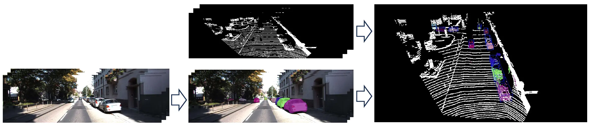
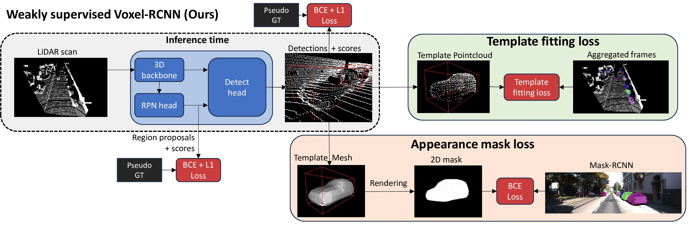
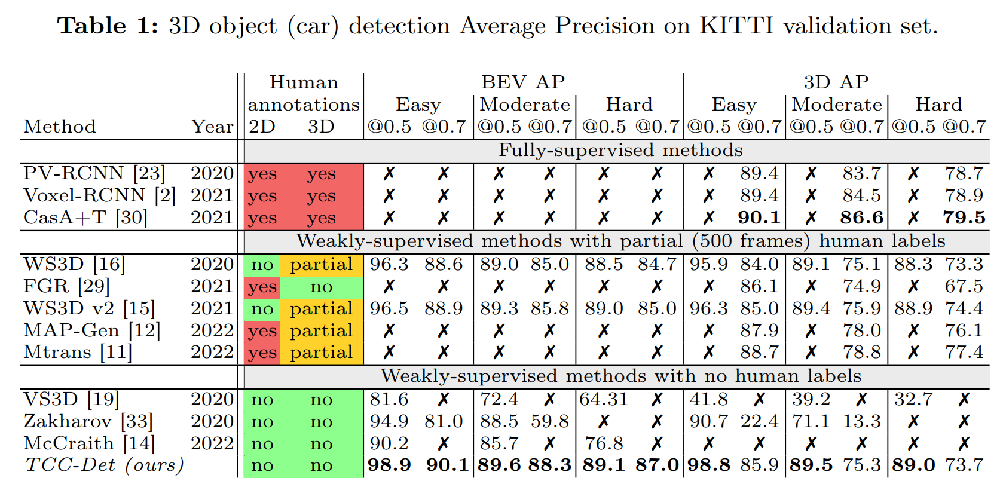

# TCC-Det: Temporarily consistent cues for weakly-supervised 3D detection

**This is the official repository of the paper "TCC-Det: Temporarily consistent cues for weakly-supervised 3D detection" accepted at ECCV 2024.**

**Authors: [Jan Skvrna](https://jskvrna.github.io/), [Lukas Neumann](https://cmp.felk.cvut.cz/~neumalu1/)**

**Affiliation: [Visual Recognition Group at Czech Technical University in Prague](https://cyber.felk.cvut.cz/research/groups-teams/vrg/)**

**Link to the paper: [ECCV2024](https://www.ecva.net/papers/eccv_2024/papers_ECCV/papers/03732.pdf)**



<figcaption>Figure 1: Combining raw unlabelled RGB camera and LiDAR sensor data across multiple frames in a temporally consistent manner allows us to exploit a generic off-the-shelf 2D object detector to train a 3D object (vehicle) detector for LiDAR point clouds.</figcaption>

---

# Abstract

Accurate object detection in LiDAR point clouds is a key prerequisite of robust and safe autonomous driving and robotics applications. Training the 3D object detectors currently involves  the need to manually annotate vasts amounts of training data, which is very time-consuming and costly. As a result, the amount of annotated training data readily available is limited, and moreover these annotated datasets likely do not contain edge-case or otherwise rare instances, simply because the probability of them occurring in such a small dataset is low.

In this paper, we propose a method to train 3D object detector without any need for manual annotations, by exploiting existing off-the-shelf vision components and by using the consistency of the world around us. The method can therefore be used to train a 3D detector by only collecting sensor recordings in the real world, which is extremely cheap and allows training using orders of magnitude more data than traditional fully-supervised methods.

The method is evaluated on KITTI and Waymo Open datasets, where it outperforms all previous weakly-supervised methods and where it narrows the gap when compared to methods using human 3D labels.

---

# Method

Code is divided into two main parts:
1. **Pseudo Ground Truth generator**: This part is further divided into multiple steps:
   1. (Waymo only) Decompressing the LiDAR point clouds from the ProtoBuf format. Action: *lidar_scans*
   2. Generating the precise frame-to-frame transformations. Action: *transformations*
   3. Running Mask-RCNN and tracker to obtain masks and correspondences. Action: *mask_tracking*
   4. Frames aggregation. Action: *frames_aggregation*
   5. Optimization of the aggregated frames to obtain precise pseudo ground truth. Action: *optimization*
2. **Training**:
   1. Using the pseudo ground truth to train the 3D object detector (OpenPCDet).
   2. Fine-tuning of the trained model on the pseudo ground truth with the additional losses (TFL and MAL).

For more details, please refer to the [paper](https://www.ecva.net/papers/eccv_2024/papers_ECCV/papers/03732.pdf).



<figcaption>Figure 2: Training pipeline of the weakly-supervised 3D object detector relying on 2D detections and shape prior hypotheses.</figcaption>

---

# Results

In the following table we provide comparison with the weakly-supervised (TCC-Det) and fully-supervised Voxel-RCNN on the KITTI validation set. 

For more details, please refer to the [paper](https://www.ecva.net/papers/eccv_2024/papers_ECCV/papers/03732.pdf).



# Inference

## Installation

To run the inference of our trained model, please follow the steps below. 

We recommend using the conda environment. Specifically the Python 3.10.14 version and CUDA 11.7.0 is recommended. Python 3.8 and 3.9 should work also fine.

If your machine is running Windows, please use the WSL2 with Ubuntu 22.04 LTS.

Unfortunately, due to license restrictions, we cannot provide the model for the Waymo Open dataset. However, the model can be trained using the provided code.

1. **Clone the repository:**
   ```bash
   git clone https://github.com/jskvrna/TCC-Det.git
   ```
2. **Install the requirements:**
   ```bash
   cd TCC-Det/
   pip install -r requirements.txt
   ```
3. **Install the [OpenPCDet](https://github.com/open-mmlab/OpenPCDet) library:**
   ```bash
   cd ..
   git clone https://github.com/open-mmlab/OpenPCDet.git
   cd OpenPCDet && python setup.py develop
   ```
   If the build is killed, limit the number of jobs:
   ```bash
   cd OpenPCDet && MAX_JOBS=4 python setup.py develop
   ```
4. Download the trained model from the [link](https://drive.google.com/file/d/13TsmFClUtDuTv3MvunrzaNGL0c58AT74/view?usp=drive_link) and save it to the `OpenPCDet/output` folder.
5. Prepare the dataset.
   1. Download the KITTI dataset into the `OpenPCDet/data/kitti/` folder from the [official website](http://www.cvlibs.net/datasets/kitti/eval_object.php?obj_benchmark=3d) and extract it as follows:
       ```
       kitti
       ├── ImageSets
       ├── testing
       │   ├── calib
       │   ├── image_2
       │   ├── image_3
       │   └── velodyne  
       └── training
           ├── calib
           ├── image_2
           ├── image_3
           ├── label_2
           └── velodyne
       ```
6. Run the inference!:
    ```bash
    cd OpenPCDet/tools
    python demo.py --cfg_file cfgs/kitti_models/voxel_rcnn_car.yaml --ckpt ../output/TCC-det_voxelRCNN.pth --data_path ../data/kitti/testing/velodyne/*.bin
    ```
    - Please modify the `ckpt`, `data_path` and `data_path` as needed.
---
# Training

## Installation

To perform the whole training process, please follow the steps below.

We recommend using the conda environment. Specifically the Python 3.10.14 version and CUDA 11.7.0 is recommended. Python 3.8 and 3.9 should work also fine.

If your machine is running Windows, please use the WSL2 with Ubuntu 22.04 LTS.

1. **Clone the repository:**
   ```bash
   git clone https://github.com/jskvrna/TCC-Det.git
   ```
2. **Install the requirements:**
   ```bash
   cd TCC-Det/
   pip install -r requirements.txt
   ```
3. **Install the [Detectron2](https://github.com/facebookresearch/detectron2) library:**
    ```bash
    python -m pip install 'git+https://github.com/facebookresearch/detectron2.git'
    ```
4. **Build the [Pytorch3D](https://github.com/facebookresearch/pytorch3d/tree/main) library from source:**
   ```bash
   git clone https://github.com/facebookresearch/pytorch3d.git
   cd pytorch3d && pip install -e .
   ```
   If the build fails, because the cc1plus is killed, limit the number of jobs:
   ```bash
   cd pytorch3d && MAX_JOBS=4 pip install -e .
   ```
5. **Install the [OpenPCDet](https://github.com/open-mmlab/OpenPCDet) library:**
   ```bash
   cd ..
   git clone https://github.com/open-mmlab/OpenPCDet.git
   cd OpenPCDet && python setup.py develop
   ```
   Again, if the build is killed, limit the number of jobs:
   ```bash
   cd OpenPCDet && MAX_JOBS=4 python setup.py develop
   ```
6. **Install the [Waymo Open Dataset](https://github.com/waymo-research/waymo-open-dataset) library:**
   ```bash
   pip install waymo-open-dataset-tf-2-11-0==1.6.1
   ```
   Unfortunately, there is some dependency issues within the packages, so please ignore the warnings from pip.
---

## Getting started

1. **Download the Dataset:**
   - The location of the datasets is not specified. Preferably, save it to the `data` folder of the [OpenPCDet](https://github.com/open-mmlab/OpenPCDet).
   - **KITTI**: Download the KITTI dataset from the [official website](http://www.cvlibs.net/datasets/kitti/eval_object.php?obj_benchmark=3d) and extract the data to the `KITTI` folder.
     - Unpack as following:
       ```
       KITTI/
       ├── complete_sequences
       │   ├── 2011_09_26
       │   └── ...
       └── object_detection
           ├── devkit_object
           ├── testing
           │    ├── calib
           │    ├── image_2
           │    ├── image_3
           │    └── velodyne     
           └── training
                ├── calib
                ├── image_2
                ├── image_3
                ├── label_2
                └── velodyne  
       ```
     - Specify the path in `pseudo_gt_generator/3d/configs/config.yaml` file.
   - **Waymo Open**: Download the Waymo Open dataset from the [official website](https://waymo.com/open/download/) and extract the data to the `waymo` folder.
        - Unpack as following:
        ```
         waymo/
            └── raw_data
                ├── segment-xxxx.tfrecord
                └── ...

        ```
     - Specify the path in `pseudo_gt_generator/3d/configs/config.yaml` file.
---
2. **Modify the config files:**
   1. `pseudo_gt_generator/3d/configs/config.yaml`: Modify the following (Marked as TODO):
      - `kitti_path` and `waymo_path` to the path of the datasets.
      - `detectron_config` and `model_path`.
      - `merged_frames_path`, `labels_path` and `optimized_cars_path`, those serve as output folders.
   2. `pseudo_gt_generator/3D_loss/configs/config.yaml`: Modify the following (Marked as TODO):
      - `kitti` to the path of the dataset.
      - `tcc_det` path to the pseudo_gt_generator.
      - `merged_frames` path to the merged frames.
   3. `modified_openpcdet/tools/cfgs/dataset_configs/kitti_dataset.py`: Modify the following (Marked as TODO):
      - `CUSTOM_LOADER_CONFIG` path to the pseudo_gt_generator 3D_loss config.
---   
3. **Create the pseudo ground truth labels:**
   ```bash
    cd pseudo_gt_generator/3d/
    python main.py --dataset kitti --config configs/config.yaml --action transformations
    cd ../../ 
   ```
   - Possible values:
     - `--dataset`: `kitti` or `waymo`.
     - `--config`: Path to the config file.
     - `--action`: `lidar_scans`, `transformations`, `mask_tracking`, `frames_aggregation`, `optimization`.
     
   - The process can take a long time, depending on the dataset size, the number of frames and cpu and gpu count.
   - To speed up the process, this can be parallelized by running the script multiple times with different `--seq_start` and `--seq_end`, which specifies which sequences should be done with this script instance.
---
4. **Train on the pseudo ground truth labels:**
   1. Prepare the dataset for training as stated in [OpenPCDet](https://github.com/open-mmlab/OpenPCDet/blob/master/docs/GETTING_STARTED.md)
   2. Copy the pseudo ground truth labels to the [OpenPCDet](https://github.com/open-mmlab/OpenPCDet) dataset folder with `label_replacer.py` script.
      - It has two arguments: path to the data/kitti folder and path to the pseudo ground truth labels.
   3. Prepare the labels for training with `label_preparation.py`script.
      - It has one argument: path to the data/kitti folder.
   4. Prepare the dataset with the following script:
      ```bash
      cd OpenPCDet
      python -m pcdet.datasets.kitti.kitti_dataset create_kitti_infos tools/cfgs/dataset_configs/kitti_dataset.yaml
      ```
   5. Run the training with the following command:
        ```bash
        cd tools
        python train.py --cfg_file cfgs/kitti_models/voxel_rcnn_car.yaml --batch size 25 --epochs 50 --extra_tag tcc_det
        cd ../../  
      ```
      - Please modify the `batch_size`, `epochs` and `extra_tag` as needed.
   6. To retrieve the results, open the `OpenPCDet/output` folder.
---
5. **Fine-tune training using the additional losses TFL and AML:**
   1. Prepare the dataset for training as stated in [OpenPCDet](https://github.com/open-mmlab/OpenPCDet/blob/master/docs/GETTING_STARTED.md).
   2. Copy the pseudo ground truth labels to the modified_openpcdet dataset folder with `label_replacer.py` script.
      - It has two arguments: path to the data/kitti folder and path to the pseudo ground truth labels.
   3. Prepare the labels for training with `label_preparation.py`script.
      - It has one argument: path to the data/kitti folder.
   4. Prepare the dataset with the following script:
      ```bash
      cd modified_openpcdet
      python -m pcdet.datasets.kitti.kitti_dataset create_kitti_infos tools/cfgs/dataset_configs/kitti_dataset.yaml
      ``` 
   5. Run the training with the following command:
        ```bash
        cd tools
        python train.py --cfg_file cfgs/kitti_models/voxel_rcnn_car.yaml  --pretrained_model ../../OpenPCDet/output/kitti_models/voxel_rccn_car/tcc_det/ckpt/checkpoint_epoch_50.pth --batch size 2 --epochs 10 --extra_tag tcc_det
        cd ../../  
      ```
      - Please modify the `batch_size`, `epochs` and `extra_tag` as needed.
      - The `pretrained_model` argument specifies the path to the pretrained model from the previous step.

---

## Additional Notes

This repository contains the newer version of the data handling/format in the frames aggregation, so there might be some bugs. Sorry for that, however the newer format is much more simplier and readable.

Waymo Open Dataset is not yet fully implemented in the modified_openpcdet, due to the change of the data handling/format.

Feel free to reach out and submit all issues and bugs!

---

## Citation
TODO
